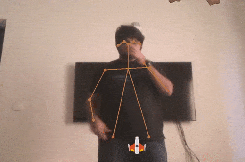

  [](https://www.codefactor.io/repository/github/wonder-tree/SpaceShooter-PoseCamera/overview/main)


## Space Shooter
Simple game in which you have to have to shoot meteoroids with you space craft and avoid meteoroids by moving left and right on your screen. Game uses our **PoseCamera** sdk to detect human body from webcam and controll space craft movement.

you can learn more about PoseCamera SDK on this link : https://github.com/Wonder-Tree/PoseCamera

### How to build
install requirements by running following command
```
pip install requirements.txt
```
and then start the game `python main.py`

### Science behind the game
The spaceship position is controlled by the following code in the game
```python
pose = self.camera.poses[0]
# Get left hip and right hip positon
r_hip = pose.keypoints[8]
l_hip = pose.keypoints[11]
                
# and find center
center = (
    (l_hip[0] + r_hip[0]) // 2, 
    (l_hip[1] + r_hip[1]) // 2
          )

# Set position 
self.player.rect.x = center[0]
```

The following lines of code is used to spawn the bullets
```python
# Bullet spawn gesture
# if right or left hand is above neck
neck = pose.keypoints[1]
# Get left and right wrist positions
r_wrist = pose.keypoints[4]
l_wrist = pose.keypoints[7]

if r_wrist[1] < neck[1] or l_wrist[1] < neck[1]:
  self.shoot = True
else:
  self.shoot = False
```



## How to play
Follow 3 easy steps to play the game
1. Stand in the front of your laptop/pc webcam at atleast 4 feet distance. Make sure your hips are visible on the camera.
2. Move your body left and right to move space craft, space craft is attached to your horizontal body movements
3. To start shooting pull your right hand up, space craft will start shooting.


<p xmlns:cc="http://creativecommons.org/ns#" xmlns:dct="http://purl.org/dc/terms/"><a property="dct:title" rel="cc:attributionURL" href="https://github.com/Wonder-Tree/PoseCameraGame1">Space Shooter Pose Camera Game</a> by <span property="cc:attributionName">Wonder Tree</span> is licensed under <a href="http://creativecommons.org/licenses/by/4.0/?ref=chooser-v1" target="_blank" rel="license noopener noreferrer" style="display:inline-block;">Attribution 4.0 International</a></p>
